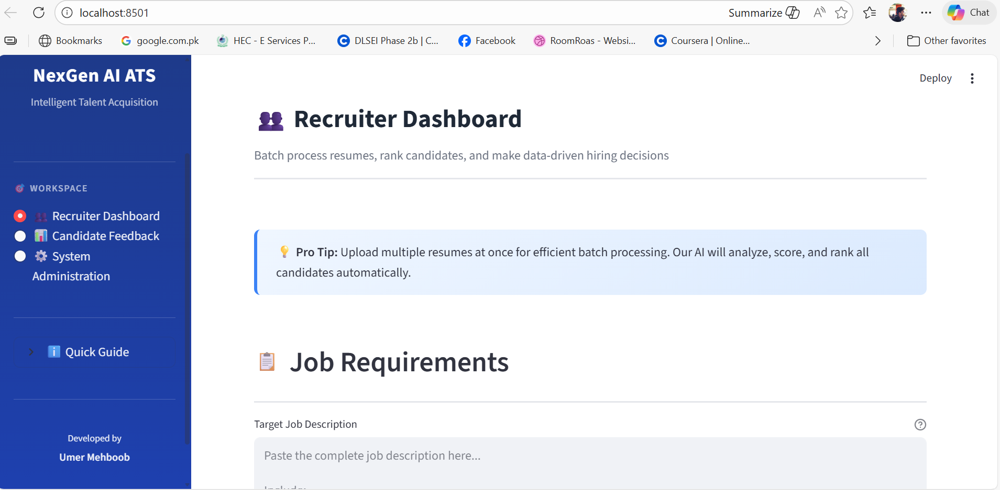
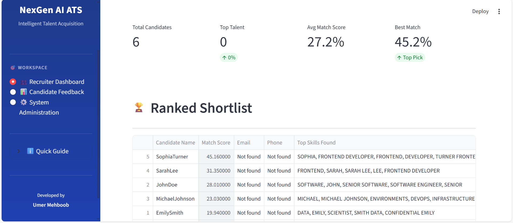
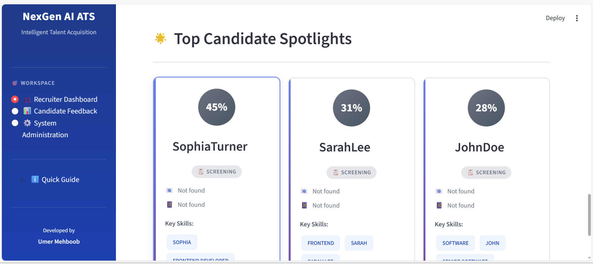
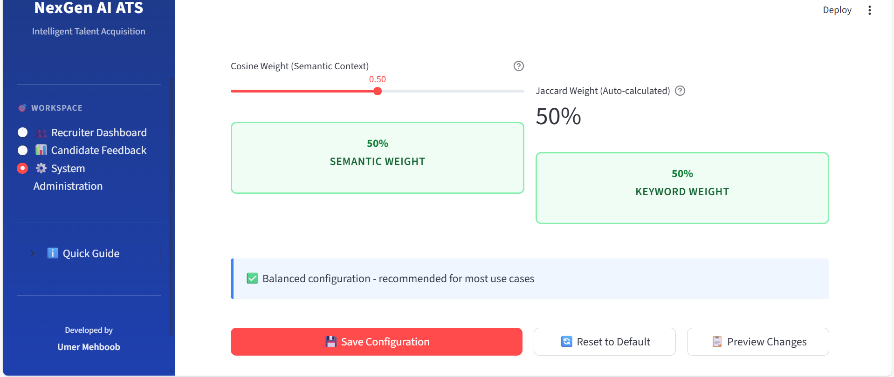
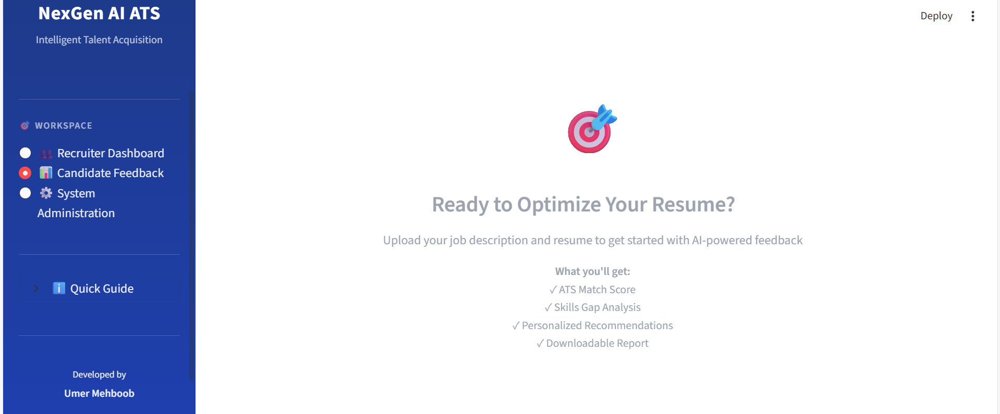

# 🎯 NexGen AI ATS: Pro-Grade Resume Matcher & Analytics Platform


NexGen AI ATS is an enterprise-ready recruiting platform designed to automate talent acquisition. By leveraging advanced **NLP (TF-IDF Vectorization)** and a **Hybrid Similarity Engine (Cosine & Jaccard)**, it ranks candidates with high precision while providing actionable feedback for both recruiters and applicants.

## 📸 Platform Interface






## ✨ Advanced Engineering Features
- **🏢 Multi-Persona Workspaces:** Dedicated logic for **Recruiters** (batch processing), **Candidates** (optimization feedback), and **Admins** (system tuning).
- **🧠 Hybrid Matching Engine:** A sophisticated blend of semantic context (Cosine) and exact keyword matching (Jaccard) with dynamic weighting.
- **🔍 Intelligent Deep Parsing:** The `ResumeParser` uses advanced Regex patterns to segment resumes into Experience, Education, Skills, and Projects for granular analysis.
- **⚙️ Dynamic System Configuration:** Full administrative control over the skill taxonomy and scoring weights via a `config.yaml` interface—no code changes required.
- **📊 Candidate Gap Analysis:** Provides instant "Skills Gap" visualizations and priority-coded recommendations to help candidates align their profiles with job requirements.

## 📂 Modular System Architecture
The project follows a scalable, production-ready structure to separate core logic from UI components:

```text
resume-job-matcher/
├── core/               # Matching engine, NLP parsing, and skill extraction logic
├── views/              # Multi-page Streamlit dashboards (Recruiter, Candidate, Admin)
├── utils/              # Text normalization and Regex contact extraction utilities
├── data/               # Persistent storage for config.yaml and job descriptions
├── app_ui.py           # Main application entry point & routing engine
└── requirements.txt    # Production dependencies

🛠️ Installation
Clone the repository

Bash

git clone [https://github.com/Umerheree/smart-resume-matcher.git](https://github.com/Umerheree/smart-resume-matcher.git)
cd smart-resume-matcher
Install dependencies

Bash

pip install -r requirements.txt
Run the Application

Bash

streamlit run app_ui.py

🧩 Technical Deep Dive: How It Works
Extraction Pipeline: The system utilizes pypdf to extract raw text, which is then cleaned via custom Regex to remove noise and normalize casing.

Contact Extraction: An automated utility scans the full text using localized patterns to isolate emails and phone numbers.

Similarity Blending: The engine calculates two independent scores:

Cosine Similarity: Measures semantic context via TF-IDF vectors.

Jaccard Index: Measures exact set-based keyword overlap for technical skills.

Explainability: The system reveals the "Top Contributing Keywords," allowing recruiters to understand exactly why a candidate received their specific score.

👨‍💻 Author
Umer Mehboob Aspiring Software Engineer & CS Student 
